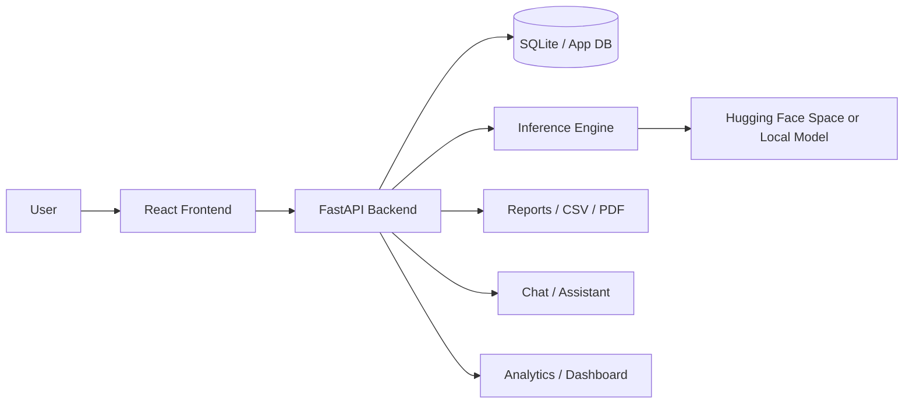

# LeafSense AI Project Documentation

This document is the single consolidated reference for the current LeafSense AI codebase. It merges the earlier handbook chapters into one place and keeps only the information that matters for development, debugging, deployment, and interviews.

It is intended to be the single source of truth for the project from an engineering perspective.

Verification policy used throughout this document:

- if a detail was confirmed in the codebase, it is described directly
- if a detail could not be verified from the codebase, the document should say: `Not present in the current codebase.`
- assumptions are avoided unless they are clearly labeled as deployment inferences

## Table of Contents

1. [Project Overview](#project-overview)
2. [Project Journey](#project-journey)
3. [Architecture](#architecture)
4. [Repository Structure](#repository-structure)
5. [Backend Deep Dive](#backend-deep-dive)
6. [Frontend Deep Dive](#frontend-deep-dive)
7. [Database and Domain Model](#database-and-domain-model)
8. [Authentication and Authorization](#authentication-and-authorization)
9. [AI Module and Inference](#ai-module-and-inference)
10. [API Reference](#api-reference)
11. [Image Detection Pipeline](#image-detection-pipeline)
12. [Deployment Model](#deployment-model)
13. [Product Features](#product-features)
14. [Design Decisions](#design-decisions)
15. [Debugging History](#debugging-history)
16. [Performance and Reliability](#performance-and-reliability)
17. [Frontend Page Walkthroughs](#frontend-page-walkthroughs)
18. [Backend Walkthroughs](#backend-walkthroughs)
19. [Auth and Report Walkthroughs](#auth-and-report-walkthroughs)
20. [Result and Model Walkthroughs](#result-and-model-walkthroughs)
21. [Interview Preparation](#interview-preparation)
22. [Interview Q&A](#interview-qa)
23. [Rapid-Fire Viva Sheet](#rapid-fire-viva-sheet)
24. [Revision Notes and Knowledge Checklist](#revision-notes-and-knowledge-checklist)
25. [Future Improvements](#future-improvements)

## Audience and Scope

This document is written for the original developer of the project and for engineering maintenance use. It is not a marketing summary, not a client-facing brochure, and not an end-user guide.

The purpose is knowledge transfer:

- reconstruct the system mentally
- explain why each major component exists
- show how the pieces interact
- make debugging easier when something breaks

## Senior Engineer Reading Lens

When reading each section, ask:

- what does this component do?
- why does it exist?
- why was it implemented this way?
- what alternatives were available?
- why were those alternatives rejected?
- how does it interact with the rest of the project?
- which files depend on it?
- which APIs use it?
- which database tables use it?
- which frontend pages consume it?
- what happens if this component breaks?
- how should it be debugged?
- how can it be improved?
- what interview questions can be asked from this topic?
- what mistakes do beginners usually make?
- what would a senior engineer do differently?

## Project Overview

LeafSense AI is a plant disease detection platform that lets a user upload a leaf image and receive:

- a predicted crop and disease label
- confidence scores
- severity estimates
- heatmap-style explainability
- treatment and prevention guidance
- downloadable and shareable reports

The system is designed as a React frontend + FastAPI backend application with a configurable inference layer that can run locally, in a worker process, or through a Hugging Face Space fallback.

Core entry points:

- Backend: `backend/app/main.py`
- Frontend: `frontend/src/App.tsx`
- Backend config: `backend/app/core/config.py`
- Inference engine: `backend/app/training/inference.py`
- Frontend shell: `frontend/src/components/layout/PageShell.tsx`
- Language state: `frontend/src/store/useAppStore.ts`

## Project Journey

The project evolved in phases:

1. basic upload and prediction flow
2. authentication and user profiles
3. persistence for scans, reports, and analytics
4. richer result visualization and downloadable reports
5. localization and theme persistence
6. deployment resilience using HF Space inference and model isolation
7. debugging and stabilization across Render, Vercel, and Hugging Face

The current codebase is the result of those phases being layered into a modular product rather than a single demo page.

## Architecture

High-level flow:

The architecture is intentionally split:

- frontend for UX, routing, localization, and state
- backend for auth, scans, reports, analytics, and inference orchestration
- database for persistence
- inference layer for model selection and deployment fallback

## Repository Structure

Important areas:

- `backend/` contains FastAPI app, routers, models, schemas, services, config, and training/inference code
- `frontend/` contains the React app, pages, stores, translations, API client, and utilities
- `ProjectReport/` is the generated engineering handbook folder
- `hf_space/` contains the Hugging Face Space app used for model serving

The codebase uses clear ownership boundaries:

- routes handle HTTP input/output
- services handle business logic
- models define persistence entities
- schemas define request/response shapes
- `training/` hosts model loading and inference logic

## Backend Deep Dive

`backend/app/main.py` is the backend bootstrap file. It:

- creates upload and report directories
- initializes database tables with `Base.metadata.create_all(...)`
- includes the API router collection
- mounts static file routes for uploaded images and generated reports
- exposes health endpoints

Important backend config behavior comes from `backend/app/core/config.py`:

- JWT secrets, Google OAuth values, Gemini/OpenAI values, and CORS origins are environment-driven
- model-related settings include local path, Hugging Face repo, model file, labels file, space URL, and space endpoint
- model execution can be enabled or disabled by environment
- inference can be isolated from the main process

Key route groups:

- auth
- users
- disease
- analytics
- reports
- chatbot
- contact
- dataset
- admin

Important backend services:

- `StorageService` saves uploads
- `PredictionService` orchestrates crop hint normalization, prediction, severity, and result formatting
- `ReportService` builds PDF/CSV outputs
- `GeminiService` powers assistant responses where configured
- `InferenceEngine` handles model loading, preprocessing, prediction, and Hugging Face fallback

The backend also defines:

- `get_current_user`
- `get_optional_user`
- `require_admin`

These helpers keep auth logic out of business routes.

Security implementation notes:

- password hashing is handled before persistence
- auth tokens are required for protected user routes
- admin access is derived from configured admin emails and user role checks
- CORS settings and OAuth secrets are runtime-configurable through environment variables

## Frontend Deep Dive

The frontend is a routed React app built for a product workflow, not a landing page.

Core shell:

- `App.tsx` defines the route tree and protected areas
- `PageShell.tsx` wraps the persistent layout
- `Navbar.tsx` handles theme, language, and account menu
- `Footer.tsx` contains the site footer shell

Key state:

- `useAppStore.ts` stores theme, selected language, current user, last prediction, and assistant context
- language is persisted and shared globally
- translations are resolved through `frontend/src/data/translations.ts`

Important frontend pages:

- `Home`
- `Detect Disease`
- `Result`
- `Dashboard`
- `Dataset`
- `Analytics`
- `Assistant`
- `Research`
- `Team`
- `Contact`
- `Profile`
- `Settings`
- `Auth`
- `My Reports`
- `My Diagnoses`
- `Assistant History`
- `Model`

The frontend API layer lives in `frontend/src/services/api.ts` and is responsible for:

- login/signup/profile flows
- disease prediction upload
- assistant messages
- analytics and report endpoints
- admin utilities
- Gmail contact submission

## Database and Domain Model

The application persists operational data through ORM models.

Observed entities:

- `User`
- `UserSession`
- `Scan`
- `Report`
- `ChatHistory`
- `AnalyticsSnapshot`
- `DatasetImage`
- `AdminSetting`

Observed role and severity enums:

- `UserRole`: guest, user, admin
- `Severity`: low, medium, high, critical

The data model supports:

- user accounts
- login sessions
- prediction history
- saved reports
- assistant history
- dashboard analytics
- dataset overview and admin controls

Key relationships to remember:

- `User` owns scans, sessions, reports, and chat history
- `Scan` is the central record for one prediction event
- `Report` is derived from a scan result and is used for export/download flows
- `ChatHistory` belongs to a user and stores assistant conversations
- `AnalyticsSnapshot` aggregates usage and scan behavior for reporting
- `DatasetImage` supports dataset browsing and admin dataset views
- `AdminSetting` stores site-level administrative configuration

## Authentication and Authorization

Authentication is token-based.

Flow:

1. user signs up or logs in
2. backend hashes password and returns tokens
3. frontend stores token locally
4. app restores session on refresh by fetching profile data

Authorization is layered:

- backend route guards enforce access
- admin checks can be derived from configured admin emails and user roles
- frontend protected routes hide pages from unauthenticated users

Google login is also supported through dedicated auth endpoints.

## AI Module and Inference

The inference layer is the most deployment-sensitive part of the product.

Important behavior from `backend/app/training/inference.py`:

- labels are loaded from local artifacts or Hugging Face
- model loading supports direct local load, sanitized load, and fallback reconstruction
- inference can run locally, in a worker process, or through Hugging Face Space
- preprocessing uses PIL RGB conversion, resize, NumPy float32 conversion, and batch dimension expansion
- there is no manual `/255.0` scaling in the current preprocessing path
- status reporting exposes whether labels and model are loaded and where the model was sourced from

The engine's status response is especially useful for debugging deployment:

- model configured or not
- labels loaded or not
- model load errors
- worker errors
- path errors
- source of inference
- whether fallback predictions are being used

The model is an EfficientNetB3-based plant disease classifier trained on PlantVillage-style classes.

## API Reference

Verified route groups:

### Auth

- `POST /api/v1/auth/signup`
- `POST /api/v1/auth/login`
- `POST /api/v1/auth/google`
- `POST /api/v1/auth/google-login`
- `POST /api/v1/auth/verify-otp`
- `POST /api/v1/auth/forgot-password`
- `POST /api/v1/auth/reset-password`
- `POST /api/v1/auth/logout`

### Users

- `GET /api/v1/users/profile`
- `PUT /api/v1/users/update-profile`
- `GET /api/v1/users/history`
- `GET /api/v1/users/history/{scan_id}`

### Disease

- `POST /api/v1/disease/predict`
- `GET /api/v1/disease/result/{scan_id}`

### Analytics

- `GET /api/v1/analytics/overview`
- `GET /api/v1/analytics/charts`
- `GET /api/v1/analytics/export`

### Reports

- `GET /api/v1/reports/pdf/{scan_id}`
- `GET /api/v1/reports/csv/{scan_id}`

### Assistant

- `POST /api/v1/chatbot/message`
- `GET /api/v1/chatbot/history`

### Contact

- `POST /api/v1/contact/send-gmail`

### Dataset

- `GET /api/v1/dataset/overview`

### Admin

- `GET /api/v1/admin/users`
- `GET /api/v1/admin/reports`
- `GET /api/v1/admin/settings`
- `GET /api/v1/admin/dataset`

Health checks:

- `GET /health`
- `GET /health/model`

## Image Detection Pipeline

End-to-end pipeline:

1. user uploads a leaf image
2. frontend may apply crop hints, rotation, zoom, or auto-detect selection
3. frontend posts multipart form data to the disease endpoint
4. backend stores the upload
5. prediction service normalizes crop hint and invokes inference
6. model returns probabilities
7. service computes top predictions, severity, and visual summaries
8. backend persists the scan
9. frontend renders the report-style result page

Outputs include:

- predicted label
- top-k predictions
- infected area estimate
- severity label
- treatment guidance
- heatmap/highlight images

## Deployment Model

The project is designed for split deployment:

- frontend on Vercel
- backend on Render
- model serving through Hugging Face Space when local inference is disabled or isolated

Current deployment-centric variables include:

- `ENABLE_MODEL_INFERENCE`
- `ISOLATE_MODEL_INFERENCE`
- `HUGGINGFACE_MODEL_REPO`
- `HUGGINGFACE_MODEL_FILE`
- `HUGGINGFACE_LABELS_FILE`
- `HUGGINGFACE_SPACE_URL`
- `HUGGINGFACE_SPACE_ENDPOINT`
- `HUGGINGFACE_TOKEN`
- `LEAFSENSE_MODEL_PATH`

This design lets the app remain useful even when the backend host cannot comfortably run the full TensorFlow model.

## Product Features

Functional features currently documented in the codebase:

- upload and analyze leaf images
- crop selection and auto-detect mode
- prediction results with top-k list
- disease severity and treatment recommendations
- dashboard with metrics and charts
- dataset browser and summaries
- analytics exports
- assistant chat
- profile/settings pages
- reports and history pages
- multilingual shell support
- theme persistence
- admin-oriented views

## Design Decisions

The main design choices were:

- split frontend and backend for deployment flexibility
- keep auth token-based rather than session-only
- preserve a report-like result experience instead of a raw prediction screen
- support Hugging Face fallback because model hosting can be more memory-efficient than running TensorFlow everywhere
- make localization global so the full shell changes consistently
- keep routes and services modular to make debugging and replacement easier
- prefer configuration-driven behavior over hardcoded deployment assumptions
- keep the inference path swappable so Render, local dev, and Hugging Face can coexist

Alternatives considered and rejected in the current implementation:

- a single monolithic server for UI + API + inference
- hardcoding the model path into frontend or backend source
- tying prediction to only one deployment host
- translating only one screen instead of the app shell

## Debugging History

Major debugging themes captured in the codebase:

- inference path selection
- HF repo / token / endpoint alignment
- model loading and fallback logic
- image preprocessing shape mismatches
- crop hint validation
- runtime compatibility for Hugging Face Space
- API availability from the frontend
- localization and theme behavior

The project learned to distinguish between:

- model loading failures
- inference availability failures
- frontend endpoint mistakes
- deployment configuration issues

That distinction is important because the user-facing symptom is often generic even when the root cause is specific.

## Performance and Reliability

The project favors reliability over a single-path implementation.

Practical reliability measures:

- model isolation when configured
- Hugging Face fallback when local inference is off
- health endpoints for deployment checks
- cached model loading where appropriate
- persistence for predictions and reports
- graceful error handling in the disease route

The trade-off is more configuration, but the benefit is fewer production failures.

## Frontend Page Walkthroughs

### Home

Presents the product identity and directs the user toward detection and core product areas.

### Detect Disease

The main workflow page. It supports image upload, camera input, crop selection, rotation, zoom, reset, and analyze actions.

### Result

Shows diagnosis, confidence, top predictions, treatment notes, summary cards, and export/share actions.

### Dashboard

Summarizes scans and usage with charts, counters, and activity.

### Dataset

Shows supported crops, summary metrics, and browsing/filtering views.

### Analytics

Shows trend charts, comparison metrics, and exports.

### Assistant

Chat interface tied to report context and prior interactions.

### Profile / Settings

User account management and preferences.

### My Reports / My Diagnoses / Assistant History

History-focused pages for personal scans, saved reports, and prior assistant conversations.

### Model / Research / Team / Contact

Informational pages that explain the project, team identity, and communication entry points.

## Backend Walkthroughs

### Main application

`backend/app/main.py` bootstraps the app, static mounts, router inclusion, and health checks.

### Router aggregation

`backend/app/api/__init__.py` is the central router registration layer.

### Config

`backend/app/core/config.py` is the source of truth for runtime options.

### Dependencies

`backend/app/api/dependencies.py` carries auth and role guard helpers.

### Inference

`backend/app/training/inference.py` loads labels, resolves model source, preprocesses images, and returns prediction output.

### Prediction service

`backend/app/services/prediction_service.py` combines inference results with crop logic, severity, and display formatting.

### Reports and storage

`backend/app/services/report_service.py` and `backend/app/services/storage_service.py` support output generation and file persistence.

## Auth and Report Walkthroughs

The auth flow is:

1. signup or login
2. token issuance
3. session restoration
4. route protection

The reporting flow is:

1. prediction completes
2. scan metadata is stored
3. report pages consume the result
4. PDF/CSV export buttons build downloadable artifacts

The assistant history and reports pages rely on the same saved scan identity and user association.

## Result and Model Walkthroughs

The result experience is built to show:

- diagnosis title
- disease or healthy summary
- crop type
- confidence
- infected area
- severity
- top predictions
- symptom/cause/treatment cards

The model page explains the model architecture and usage context. The engine itself is centered around the EfficientNetB3 classifier and the artifact set used in deployment.

## Interview Preparation

Likely interview questions include:

- why the stack is split into frontend and backend
- why FastAPI was selected
- how auth is restored after refresh
- how the prediction pipeline works
- why Hugging Face fallback exists
- how localization works across the shell

Good answers should always mention the actual file names and runtime behavior from this repo.

## Interview Q&A

### 1. Why is the application split into a React frontend and a FastAPI backend?

The split keeps the UI responsive and the backend focused on auth, persistence, analytics, and inference orchestration. It also matches the deployment reality of this project: the frontend can run separately from the API, and the inference path can be configured independently through backend environment variables.

### 2. How does authentication work?

The backend creates tokens during login, the frontend stores them, and protected pages restore the session by fetching the user profile. That means a refresh does not force the user to log in again as long as the token remains valid. Role checks and protected routes are layered on top of that.

### 3. What happens when a leaf image is uploaded?

The frontend sends the file to `POST /api/v1/disease/predict`. The backend stores the upload, runs the prediction service, generates top predictions and severity output, saves a scan record, and returns a structured response that the result page renders.

### 4. Why does the inference layer support Hugging Face Space fallback?

Because deployment environments do not always have enough memory or the same TensorFlow compatibility as local development. The backend can use local inference, a worker, or Hugging Face Space based on configuration, so the app still works when one runtime path is not viable.

### 5. How is localization implemented across the site?

The selected language lives in global frontend state, translations come from the shared translation map, and the navbar/footer read the same store. That is why switching language affects the whole shell rather than only one screen.

### 6. What is the role of the database?

The database stores users, sessions, scans, reports, chat history, analytics snapshots, dataset images, and admin settings. It is the persistence layer that turns prediction events into lasting product history.

### 7. How would you explain the result page to an interviewer?

It is a report-style view, not just a label output. It shows the diagnosis, confidence, crop type, infected area, severity, top predictions, and treatment guidance, plus export/share actions so the result can be used outside the app.

### 8. What are the most important deployment decisions in the project?

The most important decision is to keep inference configurable. The backend can run with local inference, isolated inference, or Hugging Face fallback. That lets the same codebase survive different hosting constraints without hardcoding a single execution model.

### 9. What would you debug first if predictions look wrong?

I would check the model path, label file, inference status endpoint, preprocessing shape, crop hint handling, and whether the backend is using local inference or the Hugging Face path. Those are the places where model mismatch and wrong-label bugs usually show up.

### 10. Why is the project more than a simple classification demo?

Because it includes authentication, history, reports, analytics, assistant chat, localization, deployment fallback, and admin-aware views. The classification model is only one part of a larger product workflow.

### 11. What is the biggest trade-off in this design?

The biggest trade-off is complexity for reliability. Separate frontend/backend/deployment paths and configurable inference give the app more robustness, but they also create more places where integration can fail if configuration drifts.

### 12. If a beginner asked how to understand the project quickly, what would you tell them?

Start with `backend/app/main.py`, `backend/app/core/config.py`, `backend/app/training/inference.py`, `frontend/src/App.tsx`, and `frontend/src/services/api.ts`. Those files show the request path, the configuration model, the prediction engine, and the frontend-to-backend contract.

### 13. Why does the backend expose health endpoints?

So deployments can verify that the app is alive and that the model subsystem is usable. That is especially important when inference may be local, isolated, or routed to Hugging Face.

### 14. Why is `backend/app/core/config.py` such an important file?

It is the runtime control panel for the entire backend. Secrets, CORS, database URL, model source, Hugging Face settings, and inference toggles all come from there.

### 15. What is the purpose of `backend/app/api/dependencies.py`?

It centralizes user lookup and access control helpers so route handlers stay clean and repeatable.

### 16. Why does the app use ORM models instead of raw SQL everywhere?

ORM models keep the codebase easier to maintain, make relationships clearer, and reduce boilerplate for scans, reports, sessions, and chat history.

### 17. What is the most important database record in the prediction flow?

The `Scan` record, because it ties the uploaded image, prediction output, severity, and user history together.

### 18. Why do reports exist separately from scans?

Scans represent prediction events, while reports are the exportable and shareable output built from those events.

### 19. What does the frontend store in local storage?

Theme, language, auth token, and related session state so the app can restore the user experience after refresh.

### 20. Why is a Zustand store used for global state?

It keeps shared UI state simple, especially for theme, language, user session, and last prediction data.

### 21. What does the navbar do besides navigation?

It manages theme and language switching, account menus, and the visible shell state of the app.

### 22. Why is localization implemented globally instead of per page?

Because the product should feel consistent across the shell. If only one page translated, the experience would feel fragmented.

### 23. How does the app know which pages are protected?

Protected routing is handled in the frontend route tree, and the backend still enforces access on the sensitive endpoints.

### 24. Why is the result page more important than the prediction label itself?

Because users need context: confidence, severity, visual cues, and guidance. The label alone is not enough for a practical diagnosis experience.

### 25. What role does the assistant/chat feature play?

It gives follow-up explanations and can use contextual report data so the app feels more like a decision-support tool than a static classifier.

### 26. Why does the project include analytics pages?

Analytics turn individual scans into usage insights, which is useful for admin review, product health, and future improvements.

### 27. What is the purpose of the dataset page?

It explains supported crops and dataset context, which helps the user understand the model’s scope and limitations.

### 28. Why is a model page included?

It documents the AI component for users and developers and gives the project a clear model-facing reference area.

### 29. How does the backend create a prediction response?

It combines inference output, crop hint handling, severity logic, and display-friendly labels into one structured response object.

### 30. Why is crop hint normalization needed?

Because the frontend may send values like auto detect or a crop name, and the backend needs to treat non-specific values consistently.

### 31. What is the main reason Hugging Face Space is used at all?

It gives the project an external place to host inference when the main backend host is not the right place to run the full model.

### 32. Why was inference isolation introduced?

To prevent the main API process from being overloaded or blocked by TensorFlow work when local inference is enabled.

### 33. What would break if `labels.json` is wrong?

The model may still output probabilities, but the labels shown to the user could be mismatched or misleading.

### 34. What would break if the model input size is wrong?

The inference call can fail with a shape mismatch, or the model can behave incorrectly if the preprocessing size does not match training.

### 35. Why are deployment environment variables important here?

Because this project’s behavior changes depending on whether local inference, isolated inference, or Hugging Face fallback is enabled.

### 36. What is the biggest backend responsibility in this system?

Orchestrating secure access, prediction flow, persistence, and exportable outputs without leaking those concerns into the frontend.

### 37. What is the biggest frontend responsibility in this system?

Turning backend data into a usable product experience with routing, localization, theme, and result presentation.

### 38. Why does the app save scans instead of only returning a response?

Saved scans make history, dashboards, reports, and admin views possible.

### 39. Why are there separate result and report views?

The result view is for immediate analysis, while the report logic supports repeat use, export, and sharing.

### 40. What is the most common debugging mistake with ML apps like this?

Assuming the model is wrong when the real issue is preprocessing, label mismatch, endpoint configuration, or environment drift.

### 41. What should you check first if the app says the model is unavailable?

Check the model status endpoint, backend logs, Hugging Face configuration, and whether the correct inference mode is enabled.

### 42. What should you check first if the UI shows the wrong disease class?

Check the uploaded model file, labels order, preprocessing shape, and whether the deployment is loading the intended artifact.

### 43. Why is the project documentation structured into multiple sections?

Because it is easier to maintain and easier to study when each major system concern has its own section.

### 44. Why is deployment a first-class topic in this project?

Because the same codebase behaves differently on local development, Render, Vercel, and Hugging Face.

### 45. What trade-off does the project make by supporting multiple inference paths?

It gains resilience and portability, but it also becomes more configuration-sensitive.

### 46. Why does the result pipeline generate visual outputs?

The visual outputs help users trust the diagnosis by showing where the model focused.

### 47. How would you explain the model page in one sentence?

It is the project’s AI-facing explanation page that describes the disease model and its role in the product.

### 48. Why is admin-aware functionality included?

Because a real product needs internal management views for users, reports, and dataset oversight.

### 49. What makes this project suitable for interview discussion?

It touches frontend state, backend APIs, database design, authentication, ML inference, deployment, debugging, and product thinking in one codebase.

### 50. If you had to summarize the project in one line for an interviewer, what would you say?

LeafSense AI is a full-stack plant disease detection system with secure auth, structured reporting, multilingual UX, and configurable model inference across local and cloud deployments.

## Rapid-Fire Viva Sheet

Use these as one-line recall prompts:

- What problem does LeafSense AI solve? Leaf image disease detection with reports and guidance.
- Why React + FastAPI? Clear separation of UI and backend responsibilities.
- Where is auth handled? Backend routes plus frontend token storage and protected routes.
- Where is prediction triggered? `POST /api/v1/disease/predict`.
- Where does inference live? `backend/app/training/inference.py`.
- Why HF fallback? Deployment memory and runtime flexibility.
- Where are translations stored? `frontend/src/data/translations.ts`.
- Where is language state stored? `frontend/src/store/useAppStore.ts`.
- What does the result page show? Diagnosis, confidence, severity, and top predictions.
- What is the biggest operational risk? Configuration drift between deployment environments.

## Revision Notes and Knowledge Checklist

Keep these facts in memory:

- backend app entry: `backend/app/main.py`
- frontend app entry: `frontend/src/App.tsx`
- config lives in `backend/app/core/config.py`
- model engine is `backend/app/training/inference.py`
- global language state is in `frontend/src/store/useAppStore.ts`
- translations live in `frontend/src/data/translations.ts`
- prediction entry point is `POST /api/v1/disease/predict`
- the app exposes `GET /health` and `GET /health/model`

Revision checklist:

- know the upload-to-result flow
- know auth token flow
- know where reports are generated
- know how deployment falls back to Hugging Face
- know which page owns which user action

## Future Improvements

Useful next enhancements:

- stronger image validation before prediction
- more farmer-friendly language support
- region-based disease warnings
- expert feedback loop for mislabeled predictions
- richer analytics by crop and geography
- more robust model monitoring and canary checks
- audit logs for prediction and report actions
- clearer model health diagnostics for end users

Items not visible in the current codebase:

- `LICENSE` inside `ProjectReport/`: Not present in the current codebase.
- any additional undocumented architecture memo: Not present in the current codebase.
